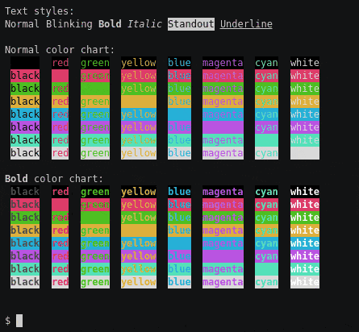

# A script for pretty-ish cli demos

This is a bash script for creating/automating cli-based demos.

To see what it can do, run it for a quick demo:

```console
$ ./demo-helpers.sh
...
```

## Usage

Include the `demo-helpers.sh` script in your demo script, then make use of the
provided functions.

```bash
#! /bin/bash

. demo-helpers.sh

cmd echo "This runs a command"
```

## Adding demos to documentation

Turn your scripted demo into an animated GIF w/
[asciinema](https://asciinema.org/) and
[asciicast2gif](https://github.com/asciinema/asciicast2gif):

```console
$ asciinema rec -c ./demo-helpers.sh demo.cast
asciinema: recording asciicast to demo.cast
asciinema: exit opened program when you're done
...
asciinema: recording finished
asciinema: asciicast saved to demo.cast

$ docker run --rm -v $PWD:/data:z asciinema/asciicast2gif -S 1 demo.cast demo.gif
==> Loading demo.cast...
==> Spawning PhantomJS renderer...
==> Generating frame screenshots...
==> Combining 279 screenshots into GIF file...
==> Done.
```

Result:  

